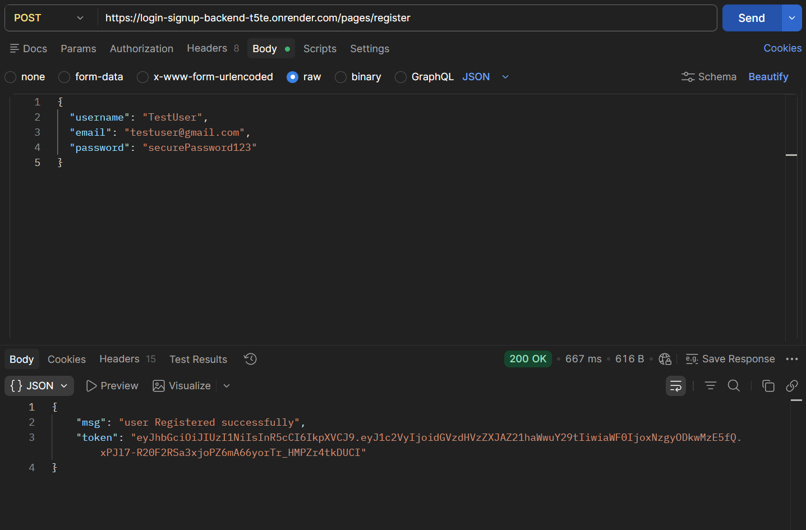
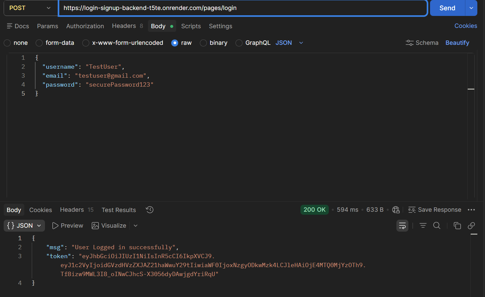

# Full-Stack Authentication API (Backend)

This repository contains the backend service for a secure Login and Registration system. It is built using Node.js, Express, and MongoDB, and features secure password handling and session management.

## 🚀 Live Deployment
The API is successfully deployed and hosted on Render.
**Base URL:** `https://login-signup-backend-t5te.onrender.com/`

---

## 🧪 API Endpoints & Postman Proof

Below are the core authentication routes, including Postman screenshots verifying their `200 OK` successful responses on the live production server.

### 1. Register a New User
* **Method:** `POST`
* **Endpoint:** `/pages/register`
* **Description:** Accepts user details, securely processes them, and stores the new user in the MongoDB database.

**Request Body:**
```json
{
  "username": "TestUser",
  "email": "testuser@gmail.com",
  "password": "securePassword123"
}

]

```

]


### 2. User Login

* **Method:** `POST`
* **Endpoint:** `/pages/login`
* **Description:** Verifies user credentials against the database and returns a success response with an authentication token.

**Request Body:**
```json
{
  "username": "TestUser",
  "email": "testuser@gmail.com",
  "password": "securePassword123"
}
```

]
